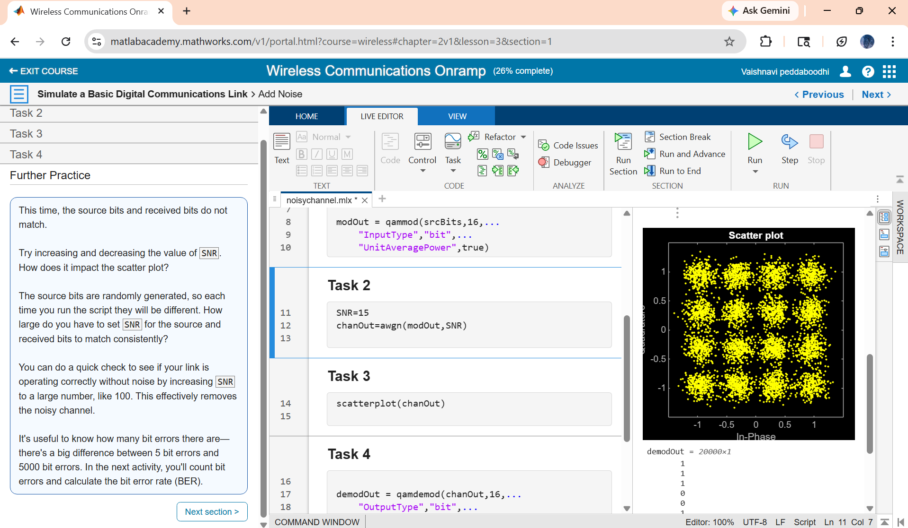
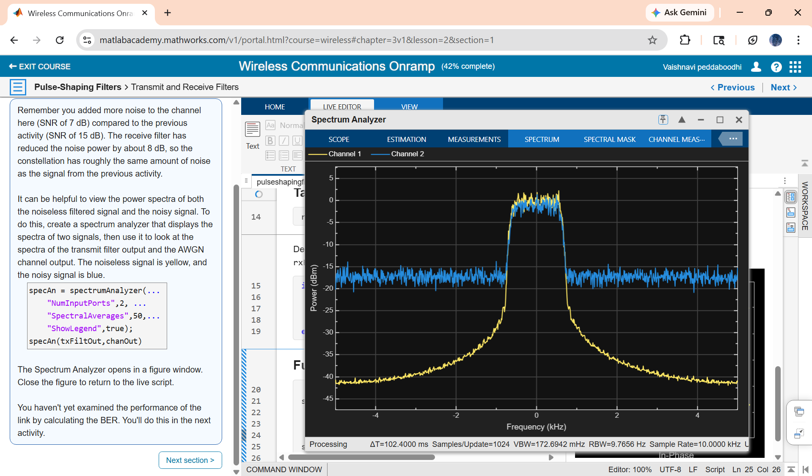
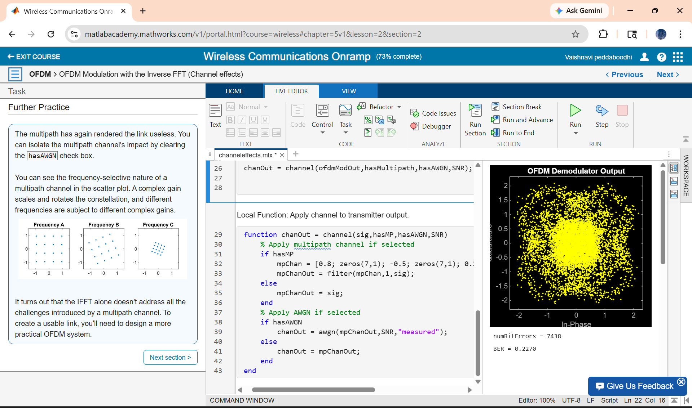
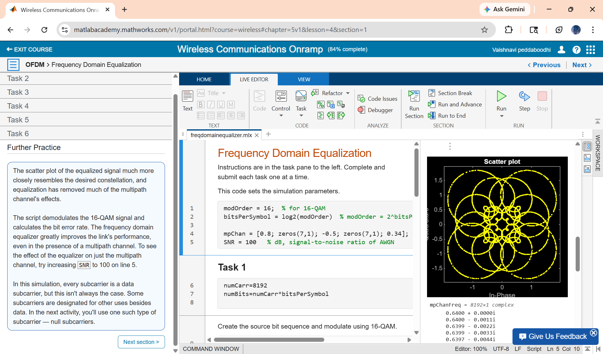

# Wireless Communication Onramp (MATLAB)

## Overview
Completed the Wireless Communication Onramp course provided by MathWorks. This course covers fundamental concepts of wireless communication systems and their implementation using MATLAB.

## Certificate
[View Certificate](certificate_wc/wireless_communications_onramp_certificate.pdf)

## Learning Progress

## Skills Gained
- Basics of wireless communication
- Signal modulation concepts
- Channel effects and noise
- MATLAB-based simulation

## Platform
MathWorks
